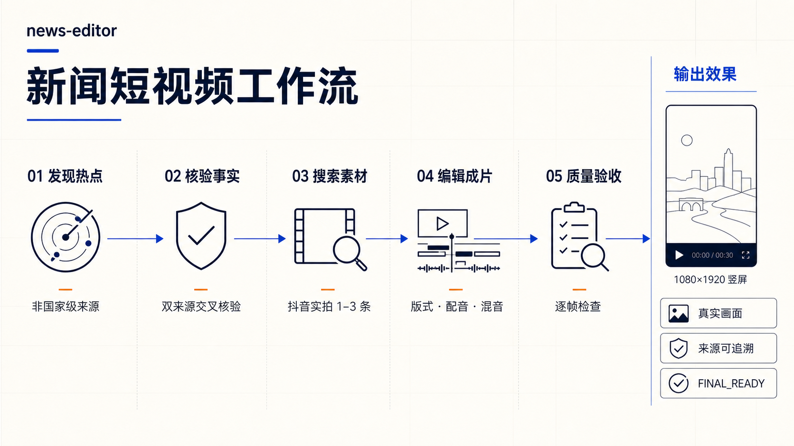
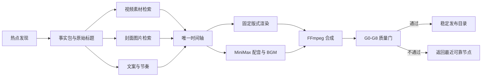

<div align="center">

# News-Editor

### 从热点发现到成片交付的可复核新闻短视频 Skill

发现新闻、核验事实、检索真实素材、制作高清封面、完成剪辑与声音，并以逐帧质量门交付 9:16 新闻视频。

[](VERSION)


[快速开始](#快速开始) · [功能](#核心功能) · [架构](#工作架构) · [演示](#成片演示) · [质量标准](#质量标准) · [文档](#文档导航)

</div>

## 简介

News-Editor 是一个面向 Codex 与兼容 Agent 平台的新闻视频生产 Skill。它将容易失控的“搜热点—找素材—写文案—配音—剪辑—验收”流程，收敛为一套有来源、有时间轴、有预览证据、可以继续修改的制作系统。

它不是简单套模板，也不是让 Agent 生成几张新闻风图片。News-Editor 以真实、可追溯的新闻素材为主体，使用固定版式与确定性脚本完成渲染，并要求机器检查和人工视觉/听觉复核同时通过后才允许发布。



适合：

- 今日热点、民生、消费、科技和产业新闻短视频；
- 已有视频、文案或参考样式的二次剪辑；
- 多主题批量生产与子智能体协作；
- 封面、分页、配音、BGM、字幕清理或版式的定向修改；
- 对既有成片进行逐帧、声音、素材来源和平台遮挡质检。

## 核心功能

| 模块 | 能力 | 关键约束 |
|---|---|---|
| 热点发现 | 从商业媒体、地方媒体、行业媒体、热搜榜及原始发布渠道发现候选 | 排除国家级媒体作为选题来源，热点榜只作线索 |
| 事实核验 | 建立事实包，区分已证实事实、推断和宣传表达 | 核心事实至少双来源交叉核验，优先纳入原始公告 |
| 视频检索 | 以原始信息标题精准检索抖音及其他可追溯视频 | 记录页面链接、账号、标题、时间码、哈希和使用依据 |
| 素材剪辑 | 自动体检分辨率、帧率、字幕区、黑边、主播、人脸与可用片段 | 真实视频为主体；清除旧文字并保持画面满幅、稳定、连续 |
| 高清封面 | 单独检索高清图片，生成无标题缩略图和候选接触表 | 禁止视频抽帧；同时通过清晰度、主体、相关性和冲击力四项门 |
| 文案与分页 | 形成短封面标题、白色说明、红色重点和逐页口播 | 一页一个信息任务，由配音与阅读共同决定页长，不机械均分 |
| 声音系统 | MiniMax 中文配音、BGM 混音、响度与真峰值检查 | 下载素材原声默认静音；逐页校验人声完整度和混音差值 |
| 固定版式 | 深海蓝三段式正文、9:16 封面、平台安全区和确定性坐标 | 唯一坐标源、固定字号、平台叠层预览，不自动缩字救溢出 |
| 自动验收 | 检查帧数、时长、音频、命名、素材身份、切点、封面与遮挡 | 机器代理指标不能替代实际看图、看视频和听音频 |
| 多 Agent 协作 | 事实、文案、视频、封面、声音、渲染和 QA 分阶段协作 | 根 Agent 固定版本与唯一时间轴；交接包带哈希，QA 只读 |

## 工作架构



News-Editor 将事实、素材、时间轴、声音和验收证据分开保存。任何环节失败都从最近可靠节点恢复，不从头盲目重跑，也不允许用占位画面、无关素材或虚构事实补齐。

### 分层设计

```text
News-Editor
├─ SKILL.md                 # 入口、路由和不可违背的生产约束
├─ config.json              # 版本、画布、声音、版式与封面的唯一机器事实源
├─ references/              # 按任务加载的选题、剪辑、封面、配音和验收规范
├─ scripts/                 # 版本门、时间轴、渲染、混音、合成和质量检查
├─ assets/
│  ├─ audio/                # 内置新闻 BGM
│  ├─ references/           # 固定版式、平台遮挡与合格成片参考
│  └─ showcase/             # README 使用的真实成片与多主题截图
├─ agents/openai.yaml       # Skill 展示名称与调用提示
└─ hooks/pre-commit         # 发布前一致性与回归门禁
```

### 单主题与批量模式

- 单主题任务由一个 Agent 按节点完成，适合定向修改和小批量制作。
- 多主题或长任务可由根 Agent 固定 GitHub commit，再并行派发事实、文案、视频和封面任务。
- 时间轴始终只有一个写入者；声音和画面在时间轴锁定后并行；最终由独立 QA 只读验收。
- 子智能体只回传结构化交接包和关键决定，长日志、截图和媒体证据留在工作区，减少上下文占用。

## 成片演示

### 完整视频

以下三条均为 1080×1920、30fps 的完整 9:16 成片。点击封面即可打开对应视频：

<table>
  <tr>
    <td width="33%" align="center">
      <a href="assets/showcase/season-change.mp4"></a><br>
      <strong>▶ 一夜换季</strong><br>天气 · 14 秒
    </td>
    <td width="33%" align="center">
      <a href="assets/showcase/food-streaming.mp4"></a><br>
      <strong>▶ 叫停畸形吃播</strong><br>社会治理 · 14 秒
    </td>
    <td width="33%" align="center">
      <a href="assets/showcase/best-rest.mp4"></a><br>
      <strong>▶ 最好的休息</strong><br>生活方式 · 14 秒
    </td>
  </tr>
</table>

> 演示文件用于展示剪辑、分页、文字层级和镜头切换。新闻生产时仍须使用当次检索、核验并登记的素材。

### 多主题正文画面

每张图都从上述成片的不同时间点独立截取，用于同时观察素材选择、三段式布局、分页和红白文字层级，不再使用同一帧重复拼接的接触表。

<table>
  <tr>
    <td width="33%" align="center">
      <br>
      <strong>一夜换季 · 01</strong><br>天气实景与首层事实
    </td>
    <td width="33%" align="center">
      <br>
      <strong>叫停畸形吃播 · 01</strong><br>事件主体与人物动作
    </td>
    <td width="33%" align="center">
      <br>
      <strong>最好的休息 · 01</strong><br>反常识切入与场景证据
    </td>
  </tr>
  <tr>
    <td width="33%" align="center">
      <br>
      <strong>一夜换季 · 02</strong><br>风险提示与场景切换
    </td>
    <td width="33%" align="center">
      <br>
      <strong>叫停畸形吃播 · 02</strong><br>补充案例与结论重点
    </td>
    <td width="33%" align="center">
      <br>
      <strong>最好的休息 · 02</strong><br>相关场景发散与行动建议
    </td>
  </tr>
</table>

### 封面缩略图门

<p align="center">
  
</p>

正式封面不是“全尺寸看起来还行”就算通过。它需要在无标题 270×360 预览中仍能看清具体主体、动作或场景，并同时满足：

1. 技术清晰；
2. 主体可辨；
3. 与新闻高度相关；
4. 有真实而不误导的视觉冲击。

任何单项失败都会换图，不允许用锐利标题、过饱和或总分补偿模糊和弱相关底图。

## 标准制作流程

1. **版本锁定**：每个新请求先实时核对 GitHub `main`，更新后重新加载 Skill。
2. **选题与事实**：发现候选、过滤来源、双来源核验并锁定原始信息标题。
3. **素材获取**：精准检索并下载真实视频；另行检索高清封面图和必要的信息截图。
4. **素材体检**：生成接触表与目标裁切预览，登记可用时间码、字幕区、主体和误导风险。
5. **文案与时间轴**：按信息任务拆页，使用实测配音与阅读时间确定页长，镜头切换与页面切换分别规划。
6. **渲染与混音**：固定版式渲染，MiniMax 分页配音，BGM 混音，再统一合成。
7. **逐帧 QA**：检查封面、第 1 帧、每页中点、切点前后、末帧、音频和平台叠层。
8. **稳定发布**：只有 G0–G8 全部通过才标记 `FINAL_READY`，发布目录只保留最终视频和封面。

## 质量标准

| 检查对象 | 必须通过 |
|---|---|
| 事实 | 核心事实双来源；数字、条件、时间与主体一致；推断不冒充事实 |
| 视频素材 | 来源可追溯；主播和 AI 主播为零；人脸近景受限；素材与对应文案一致 |
| 画面 | 1080×1920、30fps；等比满幅；没有大块黑边、跳帧、旧标题或动态字幕回流 |
| 封面 | 独立高清图片；无字幕、水印、马赛克和模糊；四项人工编辑门全部通过 |
| 正文 | 深海蓝三段式；每页 1–2 行白色说明和 1 行红色重点；平台 UI 不遮挡关键信息 |
| 节奏 | 不机械按页均分；句意完整后换页；素材不足时使用紧凑档而不是重复或慢放凑时长 |
| 配音 | MiniMax 分页生成；文本、参数、页号和 WAV 哈希可追溯；尾音不被切断 |
| 混音 | BGM 不抢人声；最终响度、真峰值、采样率和声道以编码后的 MP4 实测 |
| 交付 | 视频文件名与封面主标题一致；发布目录没有草稿、脚本、测试素材和历史版本 |

机器检查用于验证几何、帧数、时长、响度和文件契约；封面审美、素材身份、字幕残留、切点观感、内容匹配和发音仍必须实际观看或试听。

## 快速开始

### 1. 安装

克隆到当前 Agent 平台实际扫描的 Skills 目录。一个平台只保留一个发现入口。

Codex 用户级目录：

```powershell
$skillRoot = Join-Path $env:USERPROFILE '.codex\skills\news-editor'
git clone https://github.com/15972706120-coder/news-editor-skill.git $skillRoot
```

兼容 Agent 的通用目录：

```powershell
$skillRoot = Join-Path $env:USERPROFILE '.agents\skills\news-editor'
git clone https://github.com/15972706120-coder/news-editor-skill.git $skillRoot
```

不同平台需要不同扫描目录时，每个目录都使用独立、干净的克隆，避免软链接和重复发现造成版本歧义。

### 2. 首次环境检查

```powershell
pwsh -NoProfile -File (Join-Path $skillRoot 'scripts\check_environment.ps1')
```

完整制作需要 PowerShell 7、Python/Pillow、浏览器检索能力、agent-browser、yt-dlp、FFmpeg/FFprobe、Node.js、微软雅黑，以及 MiniMax API 环境变量。选择 Remotion 实现时才需要完整 Remotion 工程依赖。不要把 API Key、Cookie 或浏览器登录信息提交到 GitHub 或发送到聊天中。

### 3. 调用

```text
使用 $news-editor 制作今天的新闻内容
```

也可以直接描述任务：

```text
使用 $news-editor 搜索今天的民生热点，先给我 5 个候选主题和核验链接。

使用 $news-editor 将这条新闻制作成 9:16 视频，素材不足时使用 7–9 秒紧凑档。

使用 $news-editor 只修改现有视频封面，保持正文、声音和时长不变。

使用 $news-editor 质检这条视频，不要修改文件，只列出阻止发布的问题和证据。
```

### 4. 每次运行前核对最新版

News-Editor 不按日期缓存版本。每个新请求、任务重启或阻塞后重启，第一步都实时比较本地 commit 与 GitHub `main`：

```powershell
$runId = [guid]::NewGuid().ToString()
pwsh -NoProfile -File (Join-Path $skillRoot 'scripts\ensure_latest_skill.ps1') -RunId $runId
```

- `LATEST_READY`：当前安装与 GitHub 完全一致，可以开始任务。
- `UPDATED_READY_RELOAD`：已安全快进；重新读取新版 Skill，再用同一 `run_id` 复核。
- 其他状态：停止生产，不允许使用无法确认的新旧版本继续。

更新脚本只允许干净工作树上的快进，不执行 reset、clean、stash、合并提交或强制覆盖。

## 文件与交付边界

- 输出根目录只包含按北京时间命名的日期目录。
- 日期目录下一层是从 `1.` 开始连续编号的中文新闻目录。
- 每个新闻目录默认只保存与封面主标题同名的最终 MP4 和 `封面.png`。
- 原片、工程、配音、预览、QA、日志和历史版本保存在项目工作区，不污染发布目录。
- Cookie、浏览器 profile、临时签名地址和下载元数据不得进入 Git。

具体命名与路径以 [config.json](config.json) 为唯一机器事实源，详见 [交付契约](references/delivery-contract.md)。

## 文档导航

| 文档 | 何时读取 |
|---|---|
| [SKILL.md](SKILL.md) | 所有任务的入口、路由和核心约束 |
| [当前制作配置](references/current-production-profile-v2.md) | 开始制作或修订旧项目时 |
| [热点发现](references/topic-discovery.md) | 用户没有提供明确主题时 |
| [完整编辑 SOP](references/editorial-sop.md) | 完整制作或跨多个节点的任务 |
| [抖音素材链路](references/douyin-news-footage-pipeline.md) | 抖音检索、下载或恢复失败节点时 |
| [可执行制作链路](references/executable-production.md) | 时间轴、渲染、配音、混音和合成 |
| [封面与平台布局](references/cover-platform-layout-v2.md) | 制作封面、正文或平台预览时 |
| [锁定版式验证](references/locked-layout-validation.md) | 所有封面与正文排版任务 |
| [MiniMax 配音](references/minimax-tts.md) | 首次调用或排查配音问题时 |
| [子智能体编排](references/subagent-orchestration.md) | 多主题、批量生产或节省上下文时 |
| [交付质量门](references/delivery-gates.md) | 草稿复核与最终交付时 |
| [质量标准](references/quality-standards.md) | 准备对外发布成片时 |
| [环境手册](references/environment-setup.md) | 首次安装、升级工具或环境异常时 |

## 开发与发布

启用仓库内提交门禁：

```powershell
git -C $skillRoot config core.hooksPath hooks
```

发布前执行：

```powershell
python -X utf8 <skill-creator-path>\scripts\quick_validate.py $skillRoot
python -X utf8 (Join-Path $skillRoot 'scripts\check_skill_consistency.py')
python -X utf8 (Join-Path $skillRoot 'scripts\test_cover_geometry.py')
python -X utf8 (Join-Path $skillRoot 'scripts\test_production_contract.py')
python -X utf8 (Join-Path $skillRoot 'scripts\test_orchestration_contract.py')
```

`hooks/pre-commit` 会检查版本与配置一致性、失效链接、资产、Python 语法、封面几何、时间轴/声音/混合媒体契约以及子智能体交接哈希。需要验证真实编码链时运行 `scripts/smoke_test_mixed_renderer.py`；它只生成内部诊断样片，不是新闻产物。

## 设计边界

News-Editor 明确不做以下事情：

- 不使用 AI 自生成图片或视频冒充新闻主体和现场；
- 不把主播、AI 主播或对镜口播作为正文核心画面；
- 不使用视频帧、播放器截图或成片反抽帧制作封面；
- 不用无关库存画面、重复镜头、慢放或冻结画面凑时长；
- 不把搜索摘要、评论或未经核验的网络说法当作事实；
- 不把机器分数、代码参数或渲染成功等同于视觉、听觉和平台审核通过。

素材版权与平台授权仍由实际使用者确认。Skill 会保存来源和使用依据，但不会替代版权许可或平台最终审核。

---

<div align="center">

**News-Editor · 真实素材 · 确定时间轴 · 可复核交付**

[查看版本记录](CHANGELOG.md) · [查看完整规范](SKILL.md)

</div>
